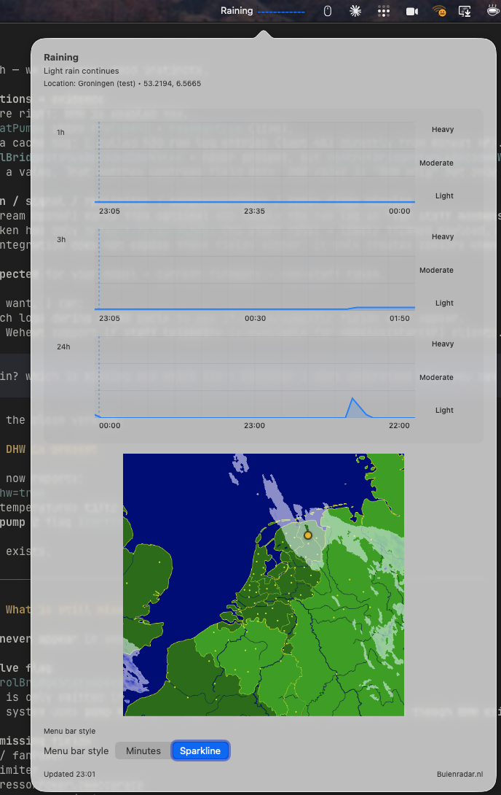

# BuienBar

Tiny macOS menu bar app that tells you if rain is coming soon using Buienradar public APIs.

## Screenshot



## Run locally

```bash
./Scripts/compile_and_run.sh
```

Grant location access when prompted (use the “Allow Location” button if needed).

### Fix repeated location prompts (dev signing)
`compile_and_run.sh` will automatically use a trusted “BuienBar Development” certificate when it exists. If macOS asks every launch, create one:

```bash
./Scripts/setup_dev_signing.sh
# Trust the certificate in Keychain Access (Code Signing)
export APP_IDENTITY="BuienBar Development"
./Scripts/compile_and_run.sh
```

## What it shows
- Menu bar icon (rain in N minutes or sparkline, toggle in popover)
- Stacked rain sparklines: 1h / 3h / 24h
- Buienradar rain radar still image

## Data sources
- Rain 3h: https://graphdata.buienradar.nl/2.0/forecast/geo/Rain3Hour
- Rain 24h: https://graphdata.buienradar.nl/2.0/forecast/geo/Rain24Hour
- Rain radar (5m NL metadata): https://image-lite.buienradar.nl/3.0/metadata/radarMapRain5mNL?history=12&forecast=0&ak=<apiKey>
- Rain radar (single w/ map): https://image.buienradar.nl/2.0/image/single/RadarMapRainNL?height=512&width=550&extension=png&renderBackground=True&renderBranding=False&renderText=False
